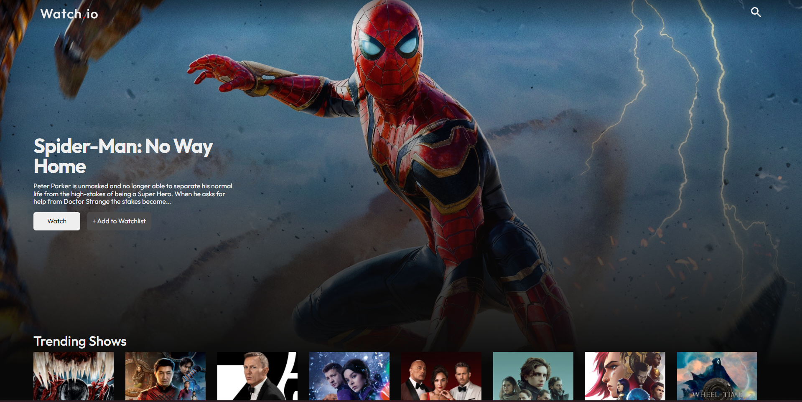
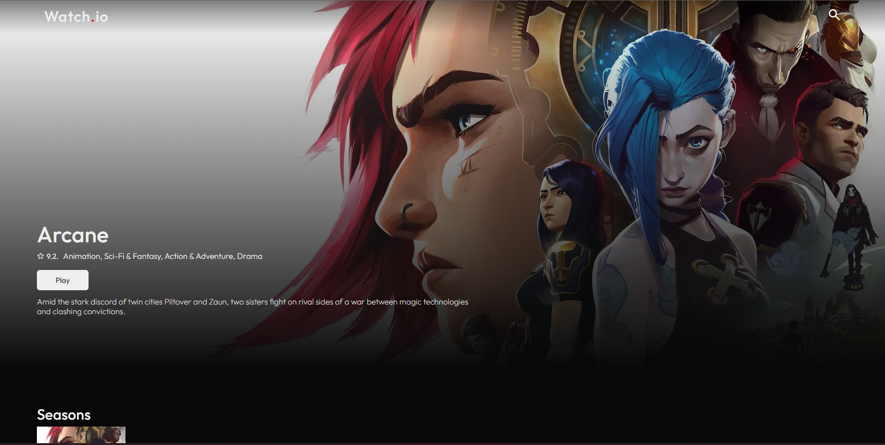
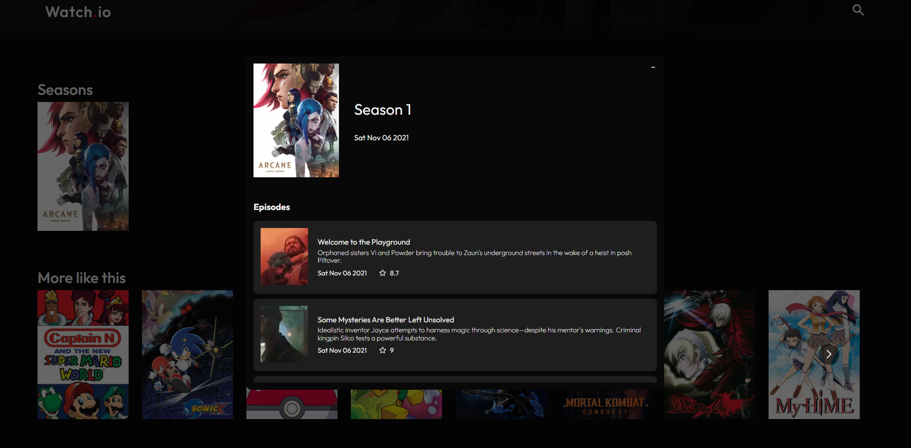

## Netflix Clone

> A simple video streaming platform demo inspired by Netflix made using Next.js.

### API
https://developers.themoviedb.org/3/getting-started/introduction

## Screenshots





## Installation

Clone the repo:

```

git clone --depth https://github.com/vikS7/netflix-clone.git
cd netflix-clone

```
Install the dependencies:

```

npm install

```

## Commands 

Running locally :  ``npm run dev``

Open http://localhost:3000 with your browser to see the result.
